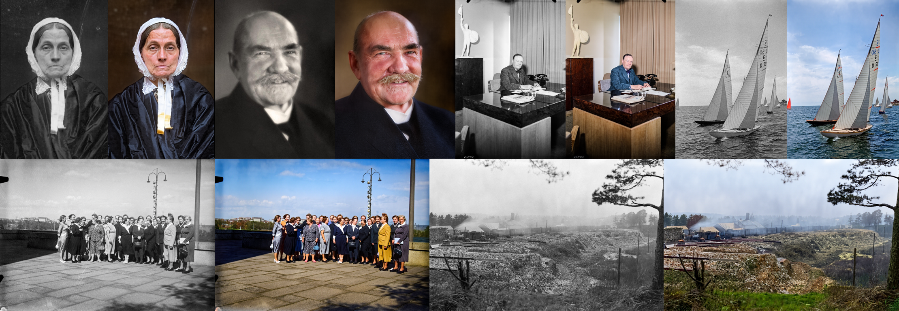
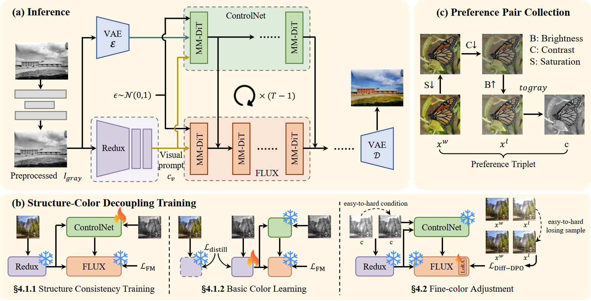
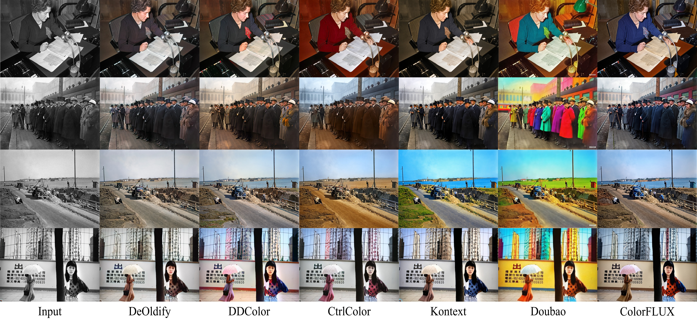

<p align="center">
  <h1 align="center">[CVPR2026] ColorFLUX: A Structure-Color Decoupling Framework for Old Photo Colorization</h1>
</p>

<p align="center">
  <b>CVPR 2026 Highlight</b>
</p>

<p align="center">
  Bingchen Li<sup>1,*</sup> &nbsp;
  Zhixin Wang<sup>2,*,&dagger;</sup> &nbsp;
  Fan Li<sup>2,&Dagger;</sup> &nbsp;
  Jiaqi Xu<sup>2</sup> &nbsp;
  Jiaming Guo<sup>2</sup> &nbsp;
  Renjing Pei<sup>2</sup> &nbsp;
  Xin Li<sup>1</sup> &nbsp;
  Zhibo Chen<sup>1,&dagger;</sup>
</p>

<p align="center">
  <sup>1</sup> University of Science and Technology of China &nbsp;&nbsp;
  <sup>2</sup> Huawei Noah's Ark Lab
</p>

<p align="center">
  <sup>*</sup> Equal contribution &nbsp;&nbsp;
  <sup>&dagger;</sup> Corresponding authors &nbsp;&nbsp;
  <sup>&Dagger;</sup> Project lead
</p>

<p align="center">
  <a href="https://openaccess.thecvf.com/content/CVPR2026/papers/Li_ColorFLUX_A_Structure-Color_Decoupling_Framework_for_Old_Photo_Colorization_CVPR_2026_paper.pdf">Paper</a> |
  <a href="https://openaccess.thecvf.com/content/CVPR2026/supplemental/Li_ColorFLUX_A_Structure-Color_CVPR_2026_supplemental.pdf">Supplementary</a>
</p>

> **Unofficial implementation of ColorFLUX.**  
> This repository is not the official release from the paper authors. It is provided for academic research and reproduction only. **Commercial use is strictly prohibited.**

## News

- **2026.06**: We provide an unofficial implementation repository for ColorFLUX.
- **2026.05**: ColorFLUX is accepted by CVPR 2026 as a Highlight paper.

## Overview

ColorFLUX is a structure-color decoupling framework for old photo colorization. Old photos usually suffer from fading, altered brightness, scratches, blur, and a severe gap from modern image distributions. ColorFLUX addresses this challenge by separately modeling structure preservation, image-grounded color semantics, and fine-grained color preference alignment.

The framework introduces visual semantic prompts for extracting fine-grained information directly from old photos, and progressive Direct Preference Optimization for learning coarse-to-fine color preferences. This helps produce vivid, realistic colorization while preserving faithful geometry.

<p align="center">
  
</p>

## Method

ColorFLUX consists of three main stages:

- **Structure Consistency Training**: injects grayscale structure into FLUX with ControlNet while avoiding color-structure entanglement.
- **Basic Color Learning**: learns image-grounded visual semantic prompts using flow matching and feature distillation.
- **Progressive DPO**: aligns color preference from strong to subtle augmentations for vivid and natural fine-color restoration.

<p align="center">
  
</p>

## Results

ColorFLUX achieves state-of-the-art performance on synthetic and real old photo colorization benchmarks, including DIV2K-valid-synthesized, DIV2K-valid-augmented, and RealOldPhotos.

<p align="center">
  
</p>

## To Do

- [ ] Release inference code.
- [ ] Release pretrained checkpoints.
- [ ] Release installation and environment instructions.
- [ ] Release example scripts for old photo colorization.

## Usage

The code and model checkpoints are being organized. Please stay tuned for updates in this unofficial repository.

## Citation

If you find this project useful for your research, please cite the original paper:

```bibtex
@inproceedings{li2026colorflux,
  title     = {ColorFLUX: A Structure-Color Decoupling Framework for Old Photo Colorization},
  author    = {Li, Bingchen and Wang, Zhixin and Li, Fan and Xu, Jiaqi and Guo, Jiaming and Pei, Renjing and Li, Xin and Chen, Zhibo},
  booktitle = {Proceedings of the IEEE/CVF Conference on Computer Vision and Pattern Recognition},
  year      = {2026}
}
```

## Notice

This is an **unofficial** implementation. It is not affiliated with, endorsed by, or maintained by the original paper authors or their institutions.

This repository is released for **academic research purposes only**. Any commercial use, including but not limited to commercial products, paid services, business integration, advertising, or monetized deployment, is **not permitted**.

## Acknowledgements

We thank the authors of ColorFLUX for their excellent work. This repository follows the paper and project materials for research reproduction.
